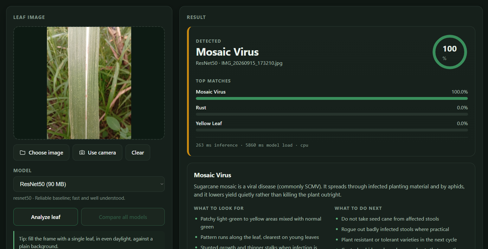
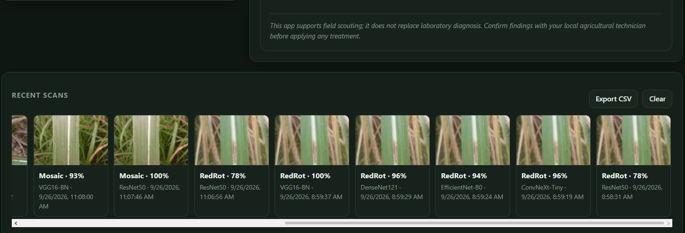

# Sweet Diagnosis — Sugarcane Leaf Disease Detection

A web app that identifies sugarcane leaf diseases from a photo. It runs **fully offline on a laptop**: the browser is only the interface, while the five trained PyTorch models run locally in Python. Any of the five models can be selected from the page, or all of them compared side by side on the same image.

---

   
   
